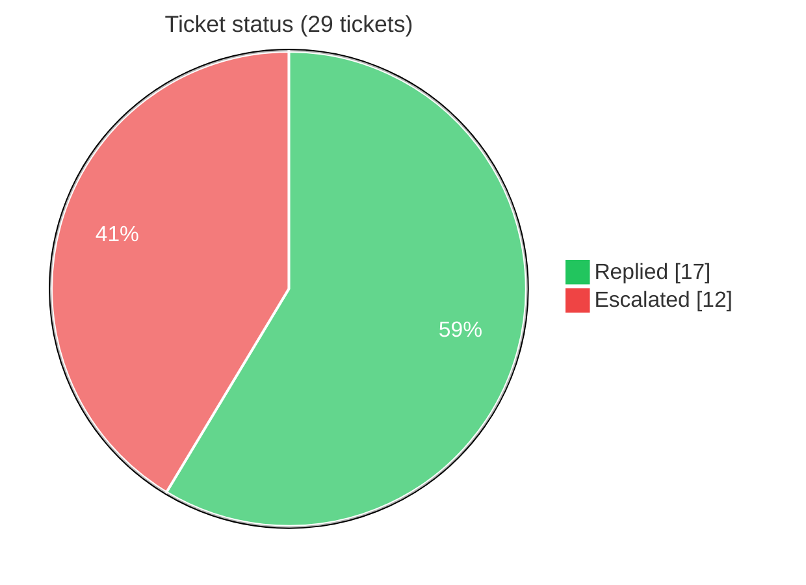
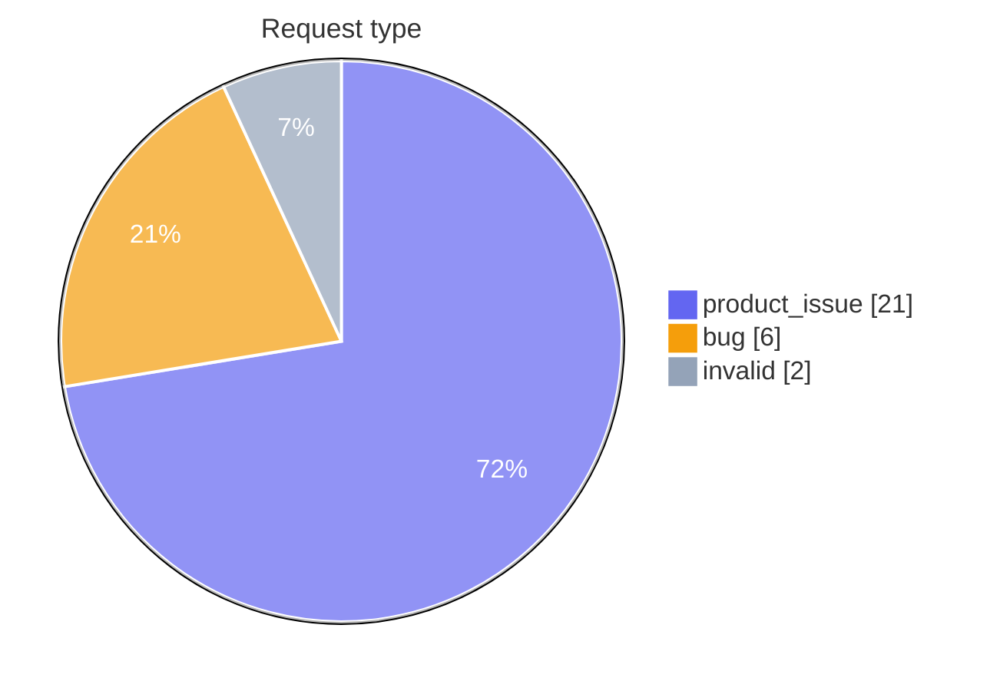
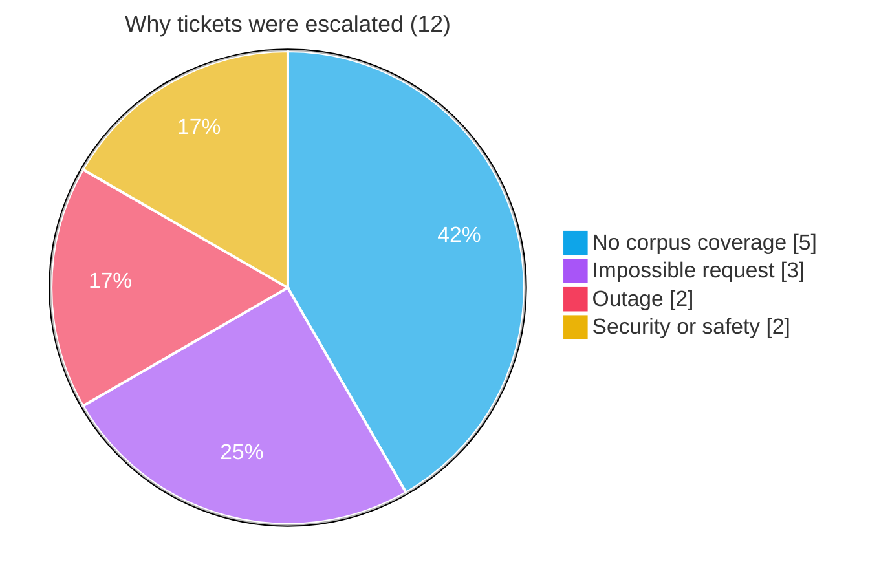
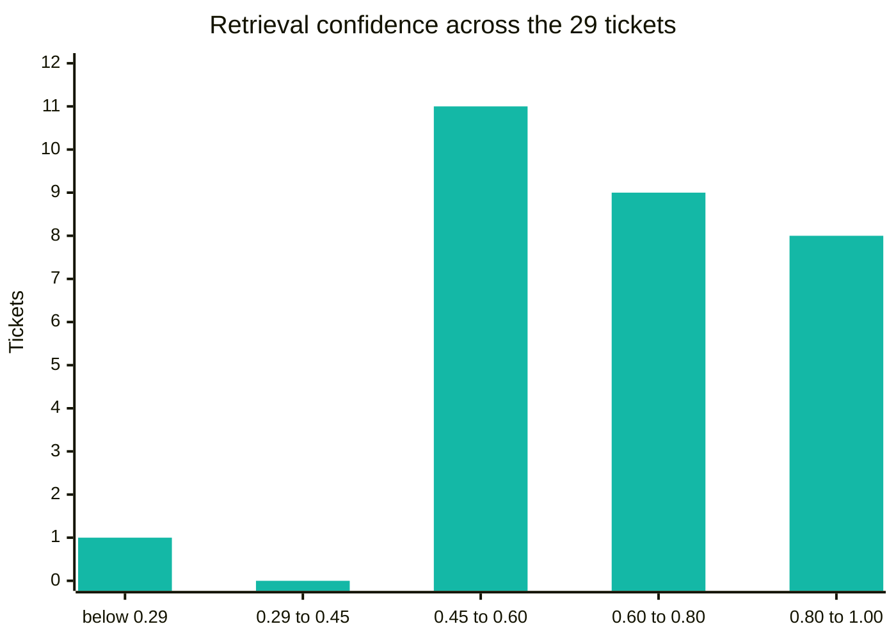
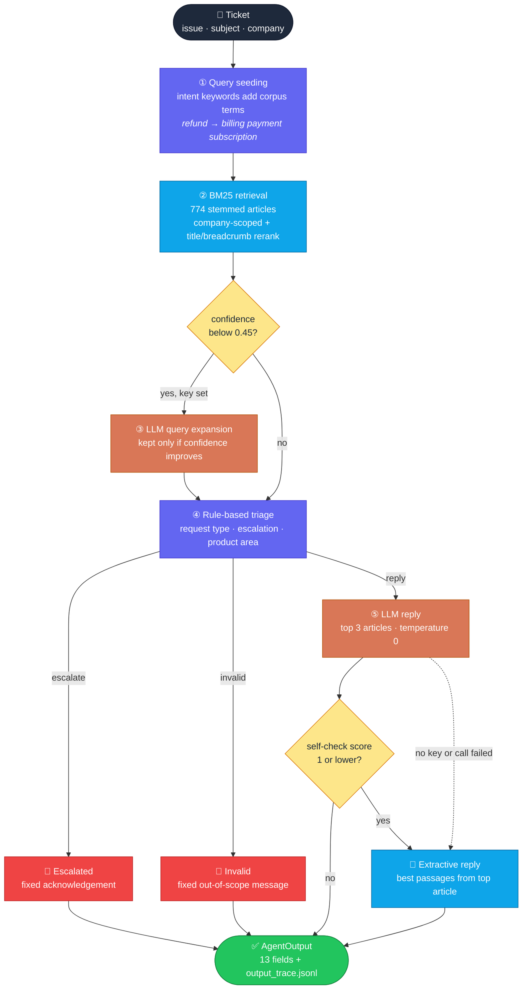
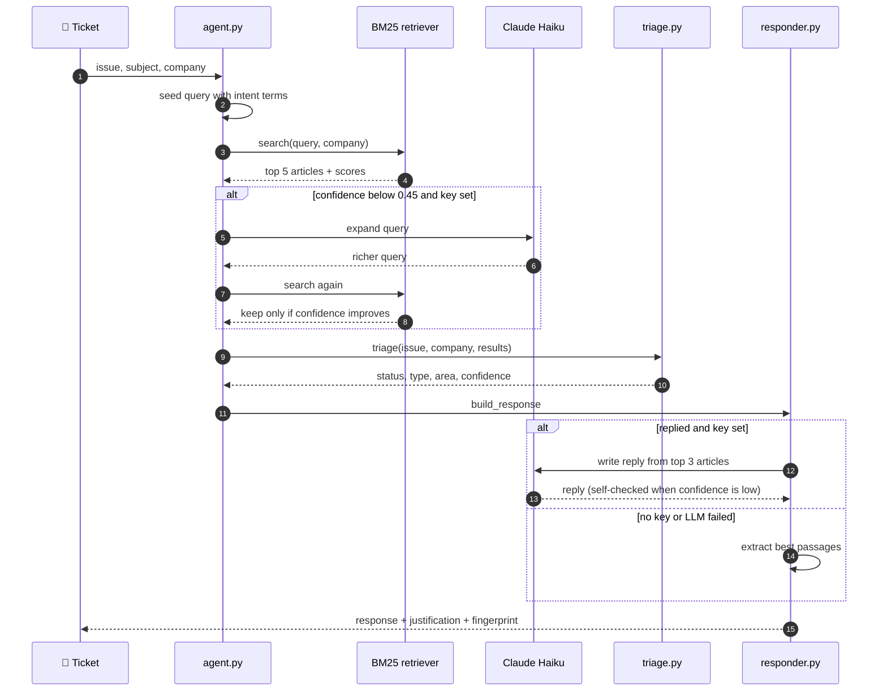
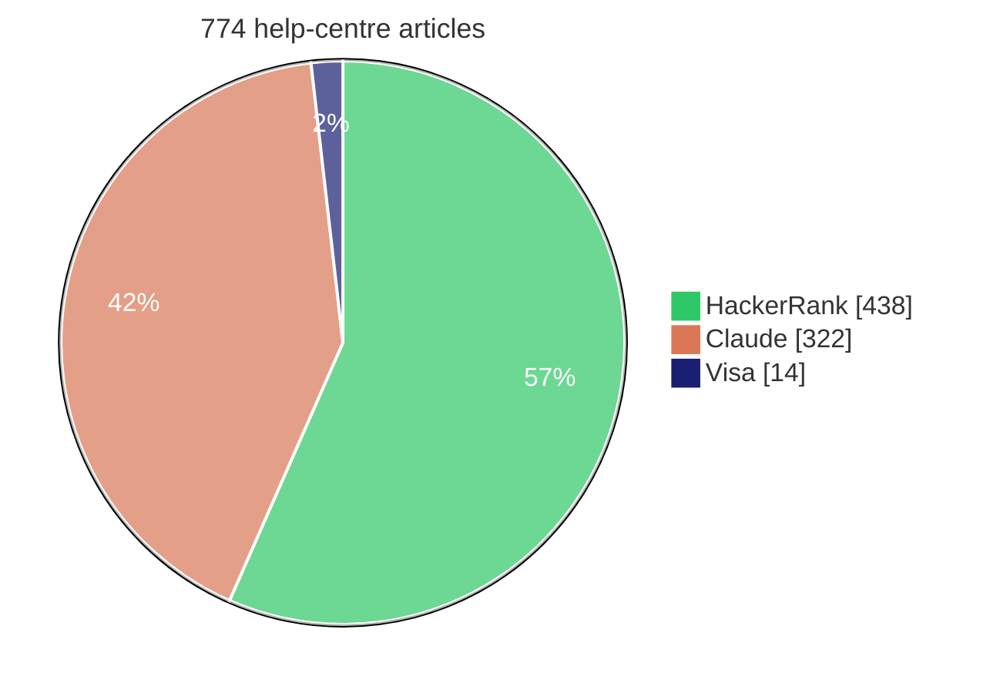
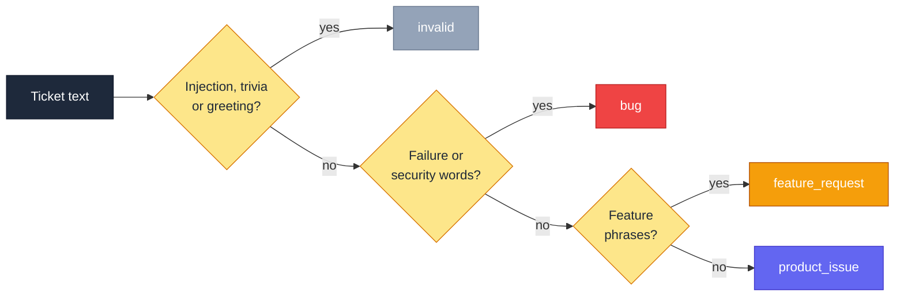

<div align="center">

# 🎯 Intelligent Support Triage Agent

### Hybrid RAG for customer support · BM25 retrieval · rule-based routing · Claude Haiku replies

<p>
  
  
  
</p>
<p>
  
  
  
  
  
</p>

A support ticket agent for **HackerRank**, **Claude** and **Visa**. For each ticket it decides whether to reply or escalate, labels the request type and product area, and writes a reply based on the help-centre articles it retrieves.

[Results](#-results) · [How it works](#-how-it-works) · [Quick start](#-quick-start) · [Triage rules](#-triage-rules) · [Design decisions](#-design-decisions)

</div>

---

## 🏆 Results

HackerRank Orchestrate, May 2026. Final leaderboard rank 116 of 12,885 (global top 1%).

The submitted output.csv was produced with anthropic/claude-3-5-haiku through OpenRouter. That model has since been retired, so the repo now uses anthropic/claude-haiku-4.5. Reruns with a key will not exactly reproduce the submitted file, because query expansion depends on the model.

### ✅ Local checks (`--validate`, `--regression`)

| Check | No key | OpenRouter key |
|---|:---:|:---:|
| ✅ Status | **10/10** | **10/10** |
| 🏷️ Request type | **10/10** | **10/10** |
| 🗂️ Product area | **10/10** | **10/10** |
| 🎯 All three correct | **10/10** | **10/10** |
| 🧪 Regression cases | **6/6** | not run |

### 🎫 Submitted run (`support_tickets.csv`)

| Metric | Value |
|---|:---:|
| 🎫 Tickets processed | **29** |
| 💬 Replied | **17** |
| 🚨 Escalated | **12** |
| 🧩 Distinct product areas | **18** |
| 📚 Articles in corpus | **774** |

> [!NOTE]
> Some of the triage keywords were written while reading the labelled samples, so 10/10 mostly shows that the rules fit those ten tickets. It says little about new tickets. The hidden test set is the real measure, and the leaderboard rank reflects it.

After the contest I updated this README, added the missing Anthropic dependency, pinned versions, and switched the OpenRouter model to anthropic/claude-haiku-4.5 because the original model was retired. Retrieval, triage rules and response logic are unchanged from the submission.

### 📊 What the submitted run looks like









---

## 🧠 How it works

Most support systems either paste raw knowledge-base articles back to users, which reads poorly, or let an LLM answer freely, which can invent facts. This system sits between the two.

Status, request type and product area are decided by fixed rules and recorded with a fingerprint. The LLM can still affect routing in one way. When a key is set, LLM query expansion can raise retrieval confidence on weak matches, and that confidence feeds the escalation rule. In testing, running without a key changed the status of 6 of 29 tickets.



| Colour | Meaning |
|---|---|
| 🟣 Purple | Fixed rules, no API calls |
| 🔵 Blue | Offline retrieval and extraction |
| 🟠 Orange | LLM calls (only with a key) |
| 🔴 Red | Fixed messages for escalated and invalid tickets |

### 🔁 One ticket, step by step



---

## 🧰 Tech stack

| Layer | Technology | Notes |
|---|---|---|
| 🔎 Retrieval | BM25Okapi (`rank-bm25`) | Offline and deterministic |
| ✂️ Stemming | Custom suffix stemmer | No NLTK or spaCy |
| 🤖 LLM (OpenRouter) | `anthropic/claude-haiku-4.5` | Used when `OPENROUTER_API_KEY` is set |
| 🤖 LLM (Anthropic SDK) | `claude-haiku-4-5-20251001` | Used when only `ANTHROPIC_API_KEY` is set |
| 📄 Corpus parsing | Python + YAML frontmatter | Handles 3 schema variants |
| ⚙️ Runtime | Python 3.10+ | No GPU, no vector database |

> [!TIP]
> Without an API key it runs in extractive mode and needs no internet. LLM replies and query expansion need network access.

### 📚 Corpus



---

## 🚀 Quick start

```bash
git clone https://github.com/yerramsettysuchita/hybrid-rag-support-agent.git
cd hybrid-rag-support-agent
pip install -r code/requirements.txt
```

**Optional.** Turn on LLM replies:

```bash
cp .env.example .env
# OPENROUTER_API_KEY=...   checked first, uses anthropic/claude-haiku-4.5
# ANTHROPIC_API_KEY=...    used when no OpenRouter key is set, uses claude-haiku-4-5-20251001
```

The provider is picked by which key is set. There is no failover between them.

### Commands

| Command | What it does |
|---|---|
| `python code/main.py --run` | Process `support_tickets.csv` and write `output.csv` + `output_trace.jsonl` |
| `python code/main.py --validate` | Score against the 10 labelled samples |
| `python code/main.py --regression` | Run the 6 pass/fail regression cases |
| `python code/main.py -i` | Interactive triage in the terminal |
| `python code/main.py -v` | Verbose logs with scores, confidence and triage internals |

> [!WARNING]
> `--run` overwrites `support_tickets/output.csv`, which is the submitted record. Run it in a copy if you want to keep the original.

---

## 🚦 Triage rules

### Escalation

| Trigger | Example phrases |
|---|---|
| 🔥 Outage | "site is down", "all requests are failing", "stopped working completely" |
| 🔐 Security or safety | "identity theft", "security vulnerability", "bug bounty", "data breach" |
| 🚫 Impossible request | "increase my score", "even though I am not the owner", "ban the seller" |
| 📭 No corpus coverage | "rescheduling of my", "zoom connectivity", "infosec process" |
| 📉 Low confidence | `confidence < 0.29` |

### Request type



### Product area (first match wins)

| Stage | Source |
|:---:|---|
| 1 | Per-company keyword overrides |
| 2 | Generic keywords when no company is given |
| 3 | Breadcrumbs of the top retrieved article |
| 4 | File path fragments (Visa articles have no breadcrumbs) |

---

## 💡 Design decisions

<details>
<summary><b>Why BM25 instead of vector search?</b></summary>
<br>
BM25 runs offline, gives the same result every time, and is easy to inspect, since every score is a sum of term-frequency weights. Adding LLM query expansion recovers some of what embeddings would add, without a 1GB+ embedding model or an embeddings API. If the LLM call fails, the raw query goes to BM25 unchanged.
</details>

<details>
<summary><b>Why only expand the query when confidence is below 0.45?</b></summary>
<br>
Strong retrievals already have the right article first, so expansion adds nothing. It only runs on weak retrievals, and the expanded query is kept only if it strictly raises confidence.
</details>

<details>
<summary><b>Why rules instead of a trained classifier?</b></summary>
<br>
Rules need no training data and every decision traces back to a phrase list. Unusual wording falls through to <code>product_issue</code>, the safe default. The tradeoff is that the rules only cover wording someone thought to write down.
</details>

<details>
<summary><b>Why escalate below confidence 0.29?</b></summary>
<br>
Chosen by looking at the validation set. The lowest-confidence correctly replied ticket there scores 0.293, and 0.29 sits just below it. Below this point retrieval has fewer than about 3 strong overlapping terms.
</details>

<details>
<summary><b>Why reply to invalid or adversarial tickets instead of escalating?</b></summary>
<br>
Escalating them wastes human agents' time. They get a fixed out-of-scope message, and escalation is kept for real tickets that need a person.
</details>

---

## 🗂️ Repository layout

```
.
├── code/
│   ├── main.py          # entry point and CLI flags
│   ├── agent.py         # pipeline orchestrator, SupportAgent.process()
│   ├── corpus.py        # loads 774 .md files + YAML frontmatter
│   ├── normalizer.py    # suffix stemmer
│   ├── retriever.py     # BM25 search + reranking
│   ├── triage.py        # request type, escalation, product area
│   ├── responder.py     # LLM reply, self-check, extractive fallback
│   ├── runner.py        # batch CSV processing and validation
│   └── requirements.txt
├── support_tickets/
│   ├── support_tickets.csv          # input tickets
│   ├── sample_support_tickets.csv   # 10 labelled samples
│   ├── output.csv                   # submitted predictions
│   └── output_trace.jsonl           # per-ticket decision trace
├── data/                # hackerrank (438) · claude (322) · visa (14)
├── .env.example
└── LICENSE
```

<details>
<summary><b>📦 Module reference</b></summary>

| Module | Role |
|---|---|
| `corpus.py` | Parses three frontmatter schemas into one `Document` dataclass (`title`, `company`, `category`, `breadcrumbs`, `body`, `source_url`, `file_path`, `raw_text`) |
| `normalizer.py` | Strips `-ing`, `-ed`, `-s`, `-es`, `-er`, `-ion`, `-tion`. Same stemming at index and query time |
| `retriever.py` | BM25Okapi, company-scoped bucket first, then cross-domain fill. Rerank adds +4 per title token and +2 per breadcrumb token. Pool is 3× top-k |
| `triage.py` | Phrase lists and regex. 30+ injection patterns including French. Confidence is `min(1.0, top_score / 60)`, halved when the top article is from another company |
| `responder.py` | Top 3 articles (≤1500 chars each) at temperature 0, under 200 words. Garbled-output check, boilerplate stripper, self-check from 1 to 5 when confidence is below 0.45 |
| `agent.py` | Wires the five stages and builds the fingerprint, rationale and summary |
| `runner.py` | Writes `output.csv` (8 columns) and `output_trace.jsonl` |

</details>

<details>
<summary><b>🧾 Output schema</b></summary>

| Column | Values |
|---|---|
| `Issue` | Original ticket body |
| `Subject` | Original subject line |
| `Company` | HackerRank / Claude / Visa |
| `Response` | Reply text |
| `Product Area` | e.g. `screen`, `billing`, `travel_support` |
| `Status` | `replied` or `escalated` |
| `Request Type` | `bug`, `feature_request`, `product_issue`, `invalid` |
| `Justification` | One line with confidence and source article |

`output_trace.jsonl` adds `confidence`, `fingerprint`, `rationale`, `top_doc_title`, `top_doc_url` and `summary` per ticket. The fingerprint is SHA-256[:8] of `issue[:100]|company|status|type|area`, so the same inputs always give the same fingerprint.

</details>

---

## 🔌 Offline mode

- The same triage rules set status, type, area, confidence and fingerprint. Query expansion is skipped, so some results can differ from a run with a key
- Replies are built from passages of the top-ranked article
- No network calls at all

---

<div align="center">

**MIT License** · © 2026 Suchita Yerramsetty · see [LICENSE](LICENSE)

</div>
